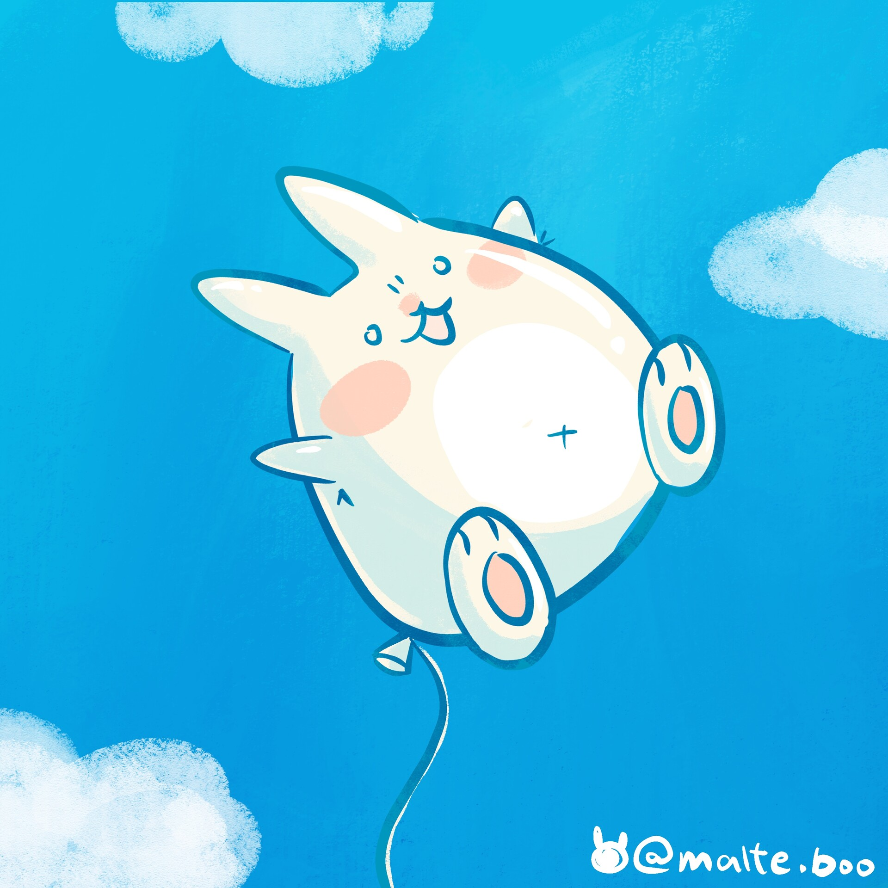
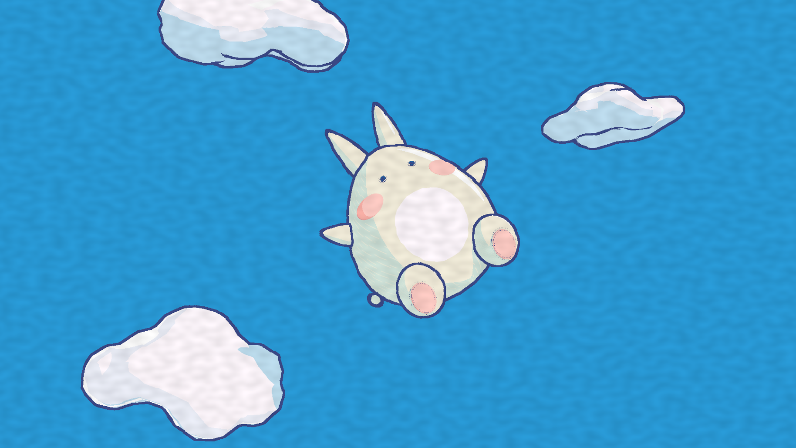
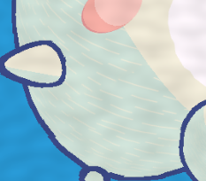
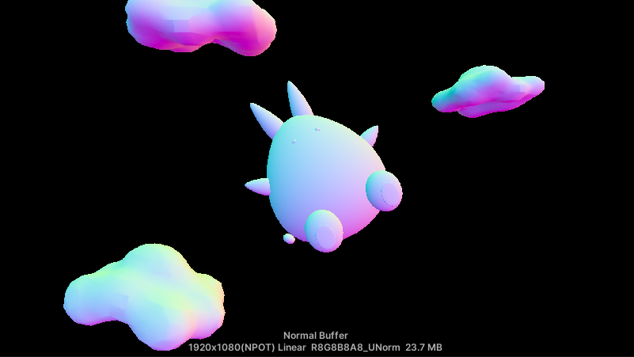
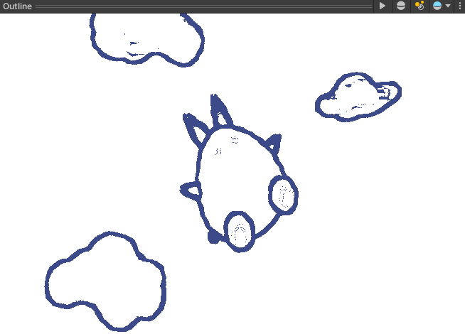
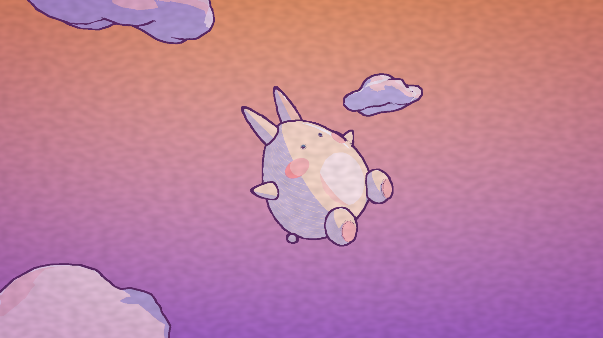

# Balloon Bunny 3D Stylization

A stylized Unity (URP) scene of a bunny-shaped balloon floating in a blue sky, based on
[this artwork by @malte.boo](https://www.artstation.com/artwork/8ePKeO).

  
  

The base codebase and the original assignment are in [instruction.md](instruction.md).

[Demo video](demo.mp4)

## Overview

- A toon shader with three tones, multiple lights and a hand-drawn shadow texture
- Rim, specular and glint highlights, each with a checkbox on the material
- A balloon that bobs and sways using vertex animation
- Post-process outlines from depth and normal buffers, with a hand-drawn "line boil" wobble
- A paper texture post-process
- A key press that switches the whole scene to a sunset style with a sunset sky + vignette

## Toon shader

`toonShader.shadergraph`. The helper functions are in `Assets/Shaders/Includes/LightingHelp.hlsl`.

- Highlight, midtone and shadow colors are picked from the diffuse term and two thresholds.
- The main light and the additional lights go through the same ramp. `Additional Light Demo.unity` is a small test scene.
- The shadows use a seamless hatching texture I drew (`Assets/Textures/selfmadeShadow.png`). It is sampled with the object's UVs, so the strokes stay on the surface, and `ShadowScale` sets the tiling. It is blended in two places: inside cast shadows, the lit and shadowed colors are mixed by the texture, and the shadow tone itself is `lerp(Shadow, Midtone, 1 - texture)`, so the strokes show up as lighter lines in the dark side of every object.
- Three highlights, each toggled with a checkbox on the material (`UseRim`, `UseSpec`, `UseGlint`):
  - **Rim** (`RimHighlight`): a hard-edged fresnel band along the silhouette, only on the lit side.
  - **Specular** (`ToonSpecular`): a hard-edged Blinn-Phong dot, using the half vector between the light and the view direction. `SpecDir` lets the light direction for the highlight be set by hand.
  - **Glint** (`EdgeGlint`): a crescent that runs parallel to the silhouette a little inside it, on the side facing `SpecDir`, and thins out towards its ends. This copies the hand-drawn reflection strokes in the concept art. `GlintOffset` is the distance from the edge, `GlintWidth` the thickness and `GlintLength` how far it reaches around.
- The graph is split into groups, and each parameter has one property node.

## Floating balloon

`toonShaderFloat.shadergraph` is the toon shader plus a vertex offset. `BalloonFloat` in `AnimationHelp.hlsl` moves vertices up and down and side to side with sine waves, in world space, so all the parts move together. The `_Float` materials use it.

Parameters: `BobAmplitude`, `BobSpeed`, `SwayAmplitude`, `SwaySpeed`.

## Outlines

- `Full Screen Feature` had a bug: it blitted the color buffer through the material into a temporary buffer and stopped there, so nothing reached the screen. The fix is a second blit from the temporary buffer back to the color buffer, without the material.
- `NormalFeature` renders scene normals into `Assets/Buffers/Normal Buffer` with the `Normal Copy` shader. The render texture is 1920x1080, the same as the Game view, so it lines up with the depth buffer. Depth comes from URP's depth texture.
- `NormalFeature` originally replaced every material with the normal copy material, which ignored the balloon's vertex animation, so the normal outlines stayed behind while the depth outlines moved. It now uses `overrideShader` instead, which keeps each object's own material properties, and `Normal Copy.shader` calls the same `BalloonFloat` function with those properties. Materials without the float parameters read 0 and do not move.
- Small details like the blush and belly are on the `No Normal` layer, which is excluded from the normals pass, so they do not get outlined.
- `Outline.shadergraph` calls `DetectEdges` (in `OutlineHelp.hlsl`), a Robert's Cross filter on depth and normals, and lerps the scene toward a deep blue where there is an edge. The depth difference is divided by the nearest depth so far objects are not all flagged as edges.

Parameters: `Thickness`, `DepthThreshold`, `NormalThreshold`, `OutlineColor`.

The lines wobble like a hand-drawn animation. The screen UV is pushed by gradient noise before edge detection, and the noise only changes in steps (`Floor(Time * WobbleFPS)`), so the lines jump from frame to frame instead of sliding. `WobbleAmount` is in pixels, `WobbleScale` is the noise size and `WobbleFPS` is how often it changes.

| Normal buffer | Outlines only |
|:--:|:--:|
|  |  |

## Post-processing

Each effect is a Full Screen Shader Graph with its own Full Screen Feature on the renderer. They run in this order: sunset sky, outline, paper. The sky has to come before the outline, otherwise it overwrites the half of each line that lies on the sky.

- `Paper.shadergraph` multiplies the scene by a mix of fine grain (simple noise) and large blotches (gradient noise), so the render looks like it is on paper. Parameters: `PaperGrainScale`, `PaperBlotchScale`, `PaperStrength`.
- `SunsetGlow.shadergraph` uses the scene depth to find the sky (anything further than `SkyDistance`) and replaces it with a vertical gradient from `TopColor` to `BottomColor`. Objects keep their own colors. A vignette then darkens the corners (`VignetteColor`, `VignetteSize`). `Strength` blends the whole effect in, and it is 0 in the default style.

## Style switch

Press `Space` to switch between the day style and the sunset style, and press it again to come back.

- `StyleSwitcher` holds a list of styles. Each one sets the sky color, outline color and thickness, wobble, paper strength and sunset sky strength.
- `MaterialSwapper` sits on each object and holds the materials it can use. `StyleSwitcher` tells all of them which one to show, so everything changes together. The sunset materials are the `*_Sunset` ones.
- The post-process values go back to their original values when you leave Play mode, so the material assets are not changed.

## Scene

`Assets/Scenes/HW Base.unity` has the bunny, clouds, a directional light and a camera on a pivot.

The bunny is assembled from Unity primitives. The body, ears and arms use spheres that are wider at the bottom and narrower at the top (`Assets/Models/BalloonBody.asset` and `BalloonEar.asset`); the feet, blush, eyes and belly are scaled spheres placed on the surface. The clouds are [Stylized Cloud](https://sketchfab.com/3d-models/stylized-cloud-aa515180d3774eb4aa4fa938d4049aee) from Sketchfab. `Turntable.cs` spins an object around Y.

## Credits

- Artwork: [@malte.boo](https://www.artstation.com/artwork/8ePKeO)
- Clouds: [Stylized Cloud on Sketchfab](https://sketchfab.com/3d-models/stylized-cloud-aa515180d3774eb4aa4fa938d4049aee)
- Tutorials: [NedMakesGames](https://www.youtube.com/watch?v=GQyCPaThQnA) (toon lighting), [Robin Seibold](https://youtu.be/LMqio9NsqmM) (Robert's Cross outlines), [Alexander Ameye](https://ameye.dev/notes/edge-detection-outlines/) (edge detection)
